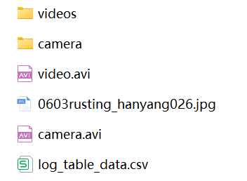

# 动物园动物图像分割系统： yolov8-seg-slimneck

### 1.研究背景与意义

[参考博客](https://gitee.com/YOLOv8_YOLOv11_Segmentation_Studio/projects)

[博客来源](https://kdocs.cn/l/cszuIiCKVNis)

研究背景与意义

随着计算机视觉技术的快速发展，图像分割作为其中一个重要的研究方向，已广泛应用于多个领域，包括医疗影像分析、自动驾驶、安防监控等。在动物园动物的监测与管理中，图像分割技术的应用显得尤为重要。通过对动物图像的精确分割，能够实现对动物种类、数量及其行为的实时监测，从而为动物保护、生态研究和动物园管理提供重要的数据支持。尤其是在当今生态环境日益恶化、物种灭绝风险加剧的背景下，动物园作为生物多样性保护的重要场所，其运营与管理的科学化、智能化显得尤为迫切。

本研究基于改进的YOLOv8模型，构建一个高效的动物园动物图像分割系统，旨在实现对马尼拉动物园内动物的自动识别与分割。该系统使用的数据集包含2500张图像，涵盖了六个动物类别：非洲狮、孟加拉虎、黑猩猩、卡比巴拉、鸵鸟和鳍蜥。这些动物不仅在生态系统中扮演着重要角色，也因其独特的外形和行为特征而受到公众的广泛关注。通过对这些动物进行精确的图像分割，可以有效提升动物园的管理效率，增强游客的观赏体验，并为相关的科研工作提供丰富的数据基础。

YOLOv8作为一种先进的目标检测与分割模型，具备高效的实时处理能力和优越的精度表现。然而，针对特定应用场景，尤其是动物园环境中的图像分割任务，仍然存在一些挑战。例如，动物在图像中的姿态、光照变化以及背景复杂性等因素，都会影响分割的准确性。因此，本研究将对YOLOv8进行改进，结合数据增强、模型优化等技术手段，以提高其在动物图像分割任务中的表现。

此外，本研究的意义还体现在以下几个方面：首先，通过构建动物图像分割系统，可以为动物园提供智能化的管理工具，帮助工作人员实时监测动物的健康状况与行为特征，进而提高动物的福利水平。其次，系统生成的分割数据可以为动物行为学、生态学等领域的研究提供重要的实验数据，促进相关学科的发展。最后，本研究的成果将为其他动物园及野生动物保护机构提供可借鉴的技术方案，推动动物保护与生态研究的深入开展。

综上所述，基于改进YOLOv8的动物园动物图像分割系统不仅具有重要的学术价值，也具备广泛的应用前景。通过本研究的实施，将为动物园的智能化管理、动物保护及生态研究提供强有力的技术支持，推动相关领域的持续发展与创新。

### 2.图片演示


注意：本项目提供完整的训练源码数据集和训练教程,由于此博客编辑较早,暂不提供权重文件（best.pt）,需要按照6.训练教程进行训练后实现上图效果。

### 3.视频演示

[3.1 视频演示](https://www.bilibili.com/video/BV1f9zzY2EzE/)

### 4.数据集信息

##### 4.1 数据集类别数＆类别名

nc: 6
names: ['African Lion', 'Bengal Tiger', 'Black Ape', 'Capybara', 'Ostrich', 'Sail Fin Lizard']


##### 4.2 数据集信息简介

数据集信息展示

在本研究中，我们使用了名为“Manila Zoo Animals”的数据集，以改进YOLOv8-seg的动物园动物图像分割系统。该数据集专门收集了来自马尼拉动物园的多种动物图像，旨在为计算机视觉领域提供高质量的训练数据。数据集包含六个主要类别，分别是非洲狮、孟加拉虎、黑猩猩、卡比巴拉、鸵鸟和帆鳍蜥蜴。这些类别不仅涵盖了动物园中常见的动物，还代表了不同的生态特征和行为模式，为图像分割任务提供了丰富的多样性。

在数据集的构建过程中，研究团队通过精心挑选和拍摄，确保每个类别的样本数量和质量均能满足深度学习模型的训练需求。每个类别的图像都经过精细标注，确保模型在训练过程中能够准确识别和分割出动物的轮廓。非洲狮作为一种大型猫科动物，其威严的外形和独特的毛发特征使其成为数据集中的重要组成部分；而孟加拉虎则以其独特的条纹和灵活的身姿，展现了另一种视觉魅力。黑猩猩则以其丰富的表情和社交行为，为数据集增添了生动的元素。卡比巴拉作为世界上最大的啮齿动物，其温和的外观和生活习性为图像分割提供了不同的挑战。鸵鸟则以其独特的体型和快速的奔跑能力，展示了鸟类的多样性。最后，帆鳍蜥蜴以其独特的外形和色彩，进一步丰富了数据集的生态背景。

数据集中的每一张图像都经过严格的筛选，确保在不同的光照条件、背景环境和动物姿态下，模型都能获得良好的表现。这种多样性不仅提升了模型的鲁棒性，也为后续的图像分割任务提供了更为广泛的应用场景。此外，数据集还包含了多种不同的拍摄角度和距离，使得模型在实际应用中能够更好地适应各种复杂的环境。

在训练过程中，我们将利用“Manila Zoo Animals”数据集中的丰富信息，通过YOLOv8-seg模型进行深度学习。该模型的先进架构和算法能够有效地处理图像分割任务，识别出动物的轮廓，并将其与背景进行区分。通过不断迭代和优化，我们期望能够提升模型在动物图像分割方面的精度和效率，从而为动物园的动物监测、保护和研究提供更为有效的技术支持。

总之，“Manila Zoo Animals”数据集不仅为本研究提供了坚实的基础，也为动物图像分割领域的进一步探索奠定了良好的基础。通过对该数据集的深入分析和应用，我们期待能够推动计算机视觉技术在动物保护和生态研究中的应用，为未来的动物园管理和生态保护提供更为科学的依据。


### 5.项目依赖环境部署教程（零基础手把手教学）

[5.1 环境部署教程链接（零基础手把手教学）](https://www.bilibili.com/video/BV1jG4Ve4E9t/?vd_source=bc9aec86d164b67a7004b996143742dc)


[5.2 安装Python虚拟环境创建和依赖库安装视频教程链接（零基础手把手教学）](https://www.bilibili.com/video/BV1nA4VeYEze/?vd_source=bc9aec86d164b67a7004b996143742dc)

### 6.手把手YOLOV8-seg训练视频教程（零基础手把手教学）

[6.1 手把手YOLOV8-seg训练视频教程（零基础小白有手就能学会）](https://www.bilibili.com/video/BV1cA4VeYETe/?vd_source=bc9aec86d164b67a7004b996143742dc)


按照上面的训练视频教程链接加载项目提供的数据集，运行train.py即可开始训练



     Epoch   gpu_mem       box       obj       cls    labels  img_size
     1/200     0G   0.01576   0.01955  0.007536        22      1280: 100%|██████████| 849/849 [14:42<00:00,  1.04s/it]
               Class     Images     Labels          P          R     mAP@.5 mAP@.5:.95: 100%|██████████| 213/213 [01:14<00:00,  2.87it/s]
                 all       3395      17314      0.994      0.957      0.0957      0.0843

     Epoch   gpu_mem       box       obj       cls    labels  img_size
     2/200     0G   0.01578   0.01923  0.007006        22      1280: 100%|██████████| 849/849 [14:44<00:00,  1.04s/it]
               Class     Images     Labels          P          R     mAP@.5 mAP@.5:.95: 100%|██████████| 213/213 [01:12<00:00,  2.95it/s]
                 all       3395      17314      0.996      0.956      0.0957      0.0845

     Epoch   gpu_mem       box       obj       cls    labels  img_size
     3/200     0G   0.01561    0.0191  0.006895        27      1280: 100%|██████████| 849/849 [10:56<00:00,  1.29it/s]
               Class     Images     Labels          P          R     mAP@.5 mAP@.5:.95: 100%|███████   | 187/213 [00:52<00:00,  4.04it/s]
                 all       3395      17314      0.996      0.957      0.0957      0.0845


### 7.50+种全套YOLOV8-seg创新点加载调参实验视频教程（一键加载写好的改进模型的配置文件）

[7.1 50+种全套YOLOV8-seg创新点加载调参实验视频教程（一键加载写好的改进模型的配置文件）](https://www.bilibili.com/video/BV1Hw4VePEXv/?vd_source=bc9aec86d164b67a7004b996143742dc)

### YOLOV8-seg算法简介

原始YOLOV8-seg算法原理

YOLOv8-seg算法是2023年由Ultralytics公司推出的一款先进的目标检测与分割模型，基于YOLO系列的深厚基础，尤其是在YOLOv7的基础上进行了重要的改进与优化。YOLOv8-seg不仅延续了YOLO系列的实时性和高效性，还在精度和功能上进行了全面提升，使其在各种复杂场景下的应用潜力大幅增强。

YOLOv8-seg的核心原理在于其深度卷积神经网络结构，这一结构使得模型能够直接对输入的整幅图像进行处理，而不需要依赖传统的滑动窗口或区域提议方法。这种设计不仅简化了处理流程，还显著提高了检测的速度和精度。YOLOv8-seg通过引入多尺度训练和测试的策略，确保模型在不同尺寸和比例的目标上都能保持良好的识别能力。此外，特征金字塔网络（FPN）的应用，使得模型能够有效地提取多层次的特征信息，从而在复杂背景下也能准确识别目标。

在YOLOv8-seg中，算法的创新不仅体现在网络结构的设计上，还包括了损失函数的优化。与之前的YOLO版本相比，YOLOv8-seg在Head标签分配和Loss计算上进行了重要改进，使得模型在训练过程中能够更好地适应不同类型的目标。这种灵活性使得YOLOv8-seg在处理各种目标检测任务时，能够更有效地进行特征学习和信息整合，从而提升了整体的检测性能。

YOLOv8-seg还引入了自适应锚框机制，这一机制通过动态调整锚框的大小和比例，使得模型能够更好地适应不同目标的形状和尺寸。这一特性在处理如人脸识别、交通标志检测等任务时，表现尤为突出。通过这种方式，YOLOv8-seg能够在保持高精度的同时，进一步提升检测的速度，确保在实时应用场景中表现优异。

此外，YOLOv8-seg的多任务学习能力使其不仅能够进行目标检测，还能实现图像分割任务。这一功能的实现得益于模型在特征提取阶段的多层次信息融合，使得YOLOv8-seg能够在同一框架下完成目标的定位与分割。这一特性在智能监控、自动驾驶等领域的应用中，提供了更为全面的解决方案。

在应用场景方面，YOLOv8-seg展现出了极大的灵活性和适应性。无论是在智能监控、自动驾驶还是在农业领域的作物监测中，YOLOv8-seg都能够凭借其高效的检测能力，快速响应各种环境变化。特别是在苹果采摘的应用中，YOLOv8-seg通过其精准的视觉识别能力，能够有效地识别和定位苹果，为自动采摘机器人提供必要的支持。这一应用不仅提高了采摘效率，还为农业自动化提供了新的可能性。

总的来说，YOLOv8-seg算法通过一系列创新和优化，成功地将目标检测与图像分割结合在一起，形成了一种高效、精准的综合解决方案。其在各类应用场景中的表现，充分证明了YOLOv8-seg在目标检测领域的领先地位。随着技术的不断进步，YOLOv8-seg将继续推动目标检测和图像分割技术的发展，为更多行业带来变革与创新。


### 9.系统功能展示（检测对象为举例，实际内容以本项目数据集为准）

图9.1.系统支持检测结果表格显示

  图9.2.系统支持置信度和IOU阈值手动调节

  图9.3.系统支持自定义加载权重文件best.pt(需要你通过步骤5中训练获得)

  图9.4.系统支持摄像头实时识别

  图9.5.系统支持图片识别

  图9.6.系统支持视频识别

  图9.7.系统支持识别结果文件自动保存

  图9.8.系统支持Excel导出检测结果数据





### 10.50+种全套YOLOV8-seg创新点原理讲解（非科班也可以轻松写刊发刊，V11版本正在科研待更新）

#### 10.1 由于篇幅限制，每个创新点的具体原理讲解就不一一展开，具体见下列网址中的创新点对应子项目的技术原理博客网址【Blog】：


[10.1 50+种全套YOLOV8-seg创新点原理讲解链接](https://gitee.com/qunmasj/good)

#### 10.2 部分改进模块原理讲解(完整的改进原理见上图和技术博客链接)【如果此小节的图加载失败可以通过CSDN或者Github搜索该博客的标题访问原始博客，原始博客图片显示正常】
### FasterNet简介
神经网络在图像分类、检测和分割等各种计算机视觉任务中经历了快速发展。尽管其令人印象深刻的性能为许多应用程序提供了动力，但一个巨大的趋势是追求具有低延迟和高吞吐量的快速神经网络，以获得良好的用户体验、即时响应和安全原因等。

如何快速？研究人员和从业者不需要更昂贵的计算设备，而是倾向于设计具有成本效益的快速神经网络，降低计算复杂度，主要以浮点运算（FLOPs）的数量来衡量。

MobileNet、ShuffleNet和GhostNet等利用深度卷积（DWConv）和/或组卷积（GConv）来提取空间特征。然而，在减少FLOPs的过程中，算子经常会受到内存访问增加的副作用的影响。MicroNet进一步分解和稀疏网络，将其FLOPs推至极低水平。尽管这种方法在FLOPs方面有所改进，但其碎片计算效率很低。此外，上述网络通常伴随着额外的数据操作，如级联、Shuffle和池化，这些操作的运行时间对于小型模型来说往往很重要。

除了上述纯卷积神经网络（CNNs）之外，人们对使视觉Transformer（ViTs）和多层感知器（MLP）架构更小更快也越来越感兴趣。例如，MobileViT和MobileFormer通过将DWConv与改进的注意力机制相结合，降低了计算复杂性。然而，它们仍然受到DWConv的上述问题的困扰，并且还需要修改的注意力机制的专用硬件支持。使用先进但耗时的标准化和激活层也可能限制其在设备上的速度。

所有这些问题一起导致了以下问题：这些“快速”的神经网络真的很快吗？为了回答这个问题，作者检查了延迟和FLOPs之间的关系，这由


其中FLOPS是每秒浮点运算的缩写，作为有效计算速度的度量。虽然有许多减少FLOPs的尝试，但都很少考虑同时优化FLOPs以实现真正的低延迟。为了更好地理解这种情况，作者比较了Intel CPU上典型神经网络的FLOPS。


图中的结果表明，许多现有神经网络的FLOPS较低，其FLOPS通常低于流行的ResNet50。由于FLOPS如此之低，这些“快速”的神经网络实际上不够快。它们的FLOPs减少不能转化为延迟的确切减少量。在某些情况下，没有任何改善，甚至会导致更糟的延迟。例如，CycleMLP-B1具有ResNet50的一半FLOPs，但运行速度较慢（即CycleMLPB1与ResNet50:111.9ms与69.4ms）。

请注意，FLOPs与延迟之间的差异在之前的工作中也已被注意到，但由于它们采用了DWConv/GConv和具有低FLOPs的各种数据处理，因此部分问题仍未解决。人们认为没有更好的选择。

该博客提供的方案通过开发一种简单、快速、有效的运算符来消除这种差异，该运算符可以在减少FLOPs的情况下保持高FLOPS。

具体来说，作者重新审视了现有的操作符，特别是DWConv的计算速度——FLOPS。作者发现导致低FLOPS问题的主要原因是频繁的内存访问。然后，作者提出了PConv作为一种竞争性替代方案，它减少了计算冗余以及内存访问的数量。

图1说明了PConv的设计。它利用了特征图中的冗余，并系统地仅在一部分输入通道上应用规则卷积（Conv），而不影响其余通道。本质上，PConv的FLOPs低于常规Conv，而FLOPs高于DWConv/GConv。换句话说，PConv更好地利用了设备上的计算能力。PConv在提取空间特征方面也很有效，这在本文后面的实验中得到了验证。

作者进一步引入PConv设计了FasterNet作为一个在各种设备上运行速度非常快的新网络家族。特别是，FasterNet在分类、检测和分割任务方面实现了最先进的性能，同时具有更低的延迟和更高的吞吐量。例如，在GPU、CPU和ARM处理器上，小模型FasterNet-T0分别比MobileVitXXS快3.1倍、3.1倍和2.5倍，而在ImageNet-1k上的准确率高2.9%。大模型FasterNet-L实现了83.5%的Top-1精度，与Swin-B不相上下，同时在GPU上提供了49%的高吞吐量，在CPU上节省了42%的计算时间。

总之，贡献如下：

指出了实现更高FLOPS的重要性，而不仅仅是为了更快的神经网络而减少FLOPs。

引入了一种简单但快速且有效的卷积PConv，它很有可能取代现有的选择DWConv。

推出FasterNet，它在GPU、CPU和ARM处理器等多种设备上运行良好且普遍快速。

对各种任务进行了广泛的实验，并验证了PConv和FasterNet的高速性和有效性。

### Conv和FasterNet的设计
#### 原理

DWConv是Conv的一种流行变体，已被广泛用作许多神经网络的关键构建块。对于输入，DWConv应用个滤波器来计算输出。如图（b）所示，每个滤波器在一个输入通道上进行空间滑动，并对一个输出通道做出贡献。

与具有的FLOPs常规Conv相比，这种深度计算使得DWConv仅仅具有的FLOPs。虽然在减少FLOPs方面有效，但DWConv（通常后跟逐点卷积或PWConv）不能简单地用于替换常规Conv，因为它会导致严重的精度下降。因此，在实践中，DWConv的通道数（或网络宽度）增加到＞以补偿精度下降，例如，倒置残差块中的DWConv宽度扩展了6倍。然而，这会导致更高的内存访问，这会造成不可忽略的延迟，并降低总体计算速度，尤其是对于I/O绑定设备。特别是，内存访问的数量现在上升到


它比一个常规的Conv的值要高，即，


注意，内存访问花费在I/O操作上，这被认为已经是最小的成本，很难进一步优化。

#### PConv作为一个基本的算子


在下面演示了通过利用特征图的冗余度可以进一步优化成本。如图所示，特征图在不同通道之间具有高度相似性。许多其他著作也涵盖了这种冗余，但很少有人以简单而有效的方式充分利用它。


具体而言，作者提出了一种简单的PConv，以同时减少计算冗余和内存访问。图4中的左下角说明了PConv的工作原理。它只需在输入通道的一部分上应用常规Conv进行空间特征提取，并保持其余通道不变。对于连续或规则的内存访问，将第一个或最后一个连续的通道视为整个特征图的代表进行计算。在不丧失一般性的情况下认为输入和输出特征图具有相同数量的通道。因此，PConv的FLOPs仅


对于典型的r＝1/4 ，PConv的FLOPs只有常规Conv的1/16。此外，PConv的内存访问量较小，即：


对于r＝1/4，其仅为常规Conv的1/4。

由于只有通道用于空间特征提取，人们可能会问是否可以简单地移除剩余的（c−）通道？如果是这样，PConv将退化为具有较少通道的常规Conv，这偏离了减少冗余的目标。

请注意，保持其余通道不变，而不是从特征图中删除它们。这是因为它们对后续PWConv层有用，PWConv允许特征信息流经所有通道。

#### PConv之后是PWConv


为了充分有效地利用来自所有通道的信息，进一步将逐点卷积（PWConv）附加到PConv。它们在输入特征图上的有效感受野看起来像一个T形Conv，与均匀处理补丁的常规Conv相比，它更专注于中心位置，如图5所示。为了证明这个T形感受野的合理性，首先通过计算位置的Frobenius范数来评估每个位置的重要性。


假设，如果一个职位比其他职位具有更大的Frobenius范数，则该职位往往更重要。对于正则Conv滤波器，位置处的Frobenius范数由计算，其中。


一个显著位置是具有最大Frobenius范数的位置。然后，在预训练的ResNet18中集体检查每个过滤器，找出它们的显著位置，并绘制显著位置的直方图。图6中的结果表明，中心位置是过滤器中最常见的突出位置。换句话说，中心位置的权重比周围的更重。这与集中于中心位置的T形计算一致。

虽然T形卷积可以直接用于高效计算，但作者表明，将T形卷积分解为PConv和PWConv更好，因为该分解利用了滤波器间冗余并进一步节省了FLOPs。对于相同的输入和输出，T形Conv的FLOPs可以计算为:


它高于PConv和PWConv的流量，即：


其中和（例如，当时）。此外，可以很容易地利用常规Conv进行两步实现。

# FasterNet作为Backbone
鉴于新型PConv和现成的PWConv作为主要的算子，进一步提出FasterNet，这是一个新的神经网络家族，运行速度非常快，对许多视觉任务非常有效。目标是使体系结构尽可能简单，使其总体上对硬件友好。


在图中展示了整体架构。它有4个层次级，每个层次级前面都有一个嵌入层（步长为4的常规4×4卷积）或一个合并层（步长为2的常规2×2卷积），用于空间下采样和通道数量扩展。每个阶段都有一堆FasterNet块。作者观察到，最后两个阶段中的块消耗更少的内存访问，并且倾向于具有更高的FLOPS，如表1中的经验验证。因此，放置了更多FasterNet块，并相应地将更多计算分配给最后两个阶段。每个FasterNet块有一个PConv层，后跟2个PWConv（或Conv 1×1）层。它们一起显示为倒置残差块，其中中间层具有扩展的通道数量，并且放置了Shorcut以重用输入特征。

除了上述算子，标准化和激活层对于高性能神经网络也是不可或缺的。然而，许多先前的工作在整个网络中过度使用这些层，这可能会限制特征多样性，从而损害性能。它还可以降低整体计算速度。相比之下，只将它们放在每个中间PWConv之后，以保持特征多样性并实现较低的延迟。

此外，使用批次归一化（BN）代替其他替代方法。BN的优点是，它可以合并到其相邻的Conv层中，以便更快地进行推断，同时与其他层一样有效。对于激活层，根据经验选择了GELU用于较小的FasterNet变体，而ReLU用于较大的FasterNet变体，同时考虑了运行时间和有效性。最后三个层，即全局平均池化、卷积1×1和全连接层，一起用于特征转换和分类。

为了在不同的计算预算下提供广泛的应用，提供FasterNet的Tiny模型、Small模型、Medium模型和Big模型变体，分别称为FasterNetT0/1/2、FasterNet-S、FasterNet-M和FasterNet-L。它们具有相似的结构，但深度和宽度不同。

架构规范如下：


### 11.项目核心源码讲解（再也不用担心看不懂代码逻辑）

#### 11.1 ultralytics\engine\__init__.py

当然可以！请提供您想要分析的代码文件内容，我将帮助您提取核心部分并进行详细的中文注释。

该文件是Ultralytics YOLO项目的一部分，文件名为`__init__.py`，它通常用于将目录标识为一个Python包。文件的开头包含了一个注释，提到这是Ultralytics YOLO项目，并标明了其使用的AGPL-3.0许可证。这意味着该项目是开源的，用户可以自由使用、修改和分发，但需要遵循相应的许可证条款。

在Python中，`__init__.py`文件的存在使得Python解释器能够将包含该文件的目录视为一个包，这样可以方便地导入该包中的模块和功能。虽然在你提供的代码中没有具体的实现内容，但通常在这个文件中可能会包含包的初始化代码、导入其他模块、定义包的版本信息、或者其他需要在包加载时执行的代码。

总结来说，`ultralytics\engine\__init__.py`文件的主要作用是标识Ultralytics YOLO项目的一个包，并可能包含一些初始化逻辑，尽管在你提供的代码中没有具体的实现细节。

#### 11.2 ultralytics\models\yolo\model.py

```python
# 导入必要的模块和类
from ultralytics.engine.model import Model
from ultralytics.models import yolo  # noqa
from ultralytics.nn.tasks import ClassificationModel, DetectionModel, PoseModel, SegmentationModel

class YOLO(Model):
    """YOLO (You Only Look Once) 目标检测模型类。"""

    @property
    def task_map(self):
        """将任务类型映射到相应的模型、训练器、验证器和预测器类。"""
        return {
            'classify': {  # 分类任务
                'model': ClassificationModel,  # 分类模型
                'trainer': yolo.classify.ClassificationTrainer,  # 分类训练器
                'validator': yolo.classify.ClassificationValidator,  # 分类验证器
                'predictor': yolo.classify.ClassificationPredictor,  # 分类预测器
            },
            'detect': {  # 检测任务
                'model': DetectionModel,  # 检测模型
                'trainer': yolo.detect.DetectionTrainer,  # 检测训练器
                'validator': yolo.detect.DetectionValidator,  # 检测验证器
                'predictor': yolo.detect.DetectionPredictor,  # 检测预测器
            },
            'segment': {  # 分割任务
                'model': SegmentationModel,  # 分割模型
                'trainer': yolo.segment.SegmentationTrainer,  # 分割训练器
                'validator': yolo.segment.SegmentationValidator,  # 分割验证器
                'predictor': yolo.segment.SegmentationPredictor,  # 分割预测器
            },
            'pose': {  # 姿态估计任务
                'model': PoseModel,  # 姿态模型
                'trainer': yolo.pose.PoseTrainer,  # 姿态训练器
                'validator': yolo.pose.PoseValidator,  # 姿态验证器
                'predictor': yolo.pose.PosePredictor,  # 姿态预测器
            },
        }
```

### 代码注释说明：
1. **导入模块**：首先导入了YOLO模型所需的基础模块和类，这些模块提供了模型的基础功能和任务实现。
2. **YOLO类**：定义了一个名为`YOLO`的类，继承自`Model`类，表示YOLO目标检测模型。
3. **task_map属性**：定义了一个属性`task_map`，用于将不同的任务类型（如分类、检测、分割和姿态估计）映射到相应的模型、训练器、验证器和预测器。这种设计使得模型可以灵活地处理多种任务。
4. **任务映射**：每种任务都有一个字典，包含四个关键部分：
   - `model`：对应的模型类。
   - `trainer`：用于训练的类。
   - `validator`：用于验证的类。
   - `predictor`：用于预测的类。

通过这种方式，YOLO模型可以方便地扩展和使用不同的任务类型。

这个程序文件定义了一个名为 `YOLO` 的类，继承自 `Model` 类，主要用于实现 YOLO（You Only Look Once）目标检测模型。文件开头的注释表明该代码遵循 AGPL-3.0 许可证，并且引用了其他模块中的类和功能。

在 `YOLO` 类中，有一个名为 `task_map` 的属性方法。这个方法返回一个字典，字典的键是不同的任务类型（如分类、检测、分割和姿态估计），每个键对应的值又是一个字典，包含了与该任务相关的模型、训练器、验证器和预测器类。这种结构使得模型能够根据不同的任务类型灵活地选择相应的组件。

具体来说，对于每种任务类型，`task_map` 字典提供了以下映射：
- 对于分类任务，映射到 `ClassificationModel` 及其相应的训练、验证和预测类。
- 对于检测任务，映射到 `DetectionModel` 及其相应的训练、验证和预测类。
- 对于分割任务，映射到 `SegmentationModel` 及其相应的训练、验证和预测类。
- 对于姿态估计任务，映射到 `PoseModel` 及其相应的训练、验证和预测类。

这种设计使得 `YOLO` 类能够方便地管理和使用不同的模型和工具，适应多种计算机视觉任务的需求。通过这种方式，用户可以根据具体的应用场景选择合适的模型和相关功能，提升了代码的可扩展性和复用性。

#### 11.3 ultralytics\trackers\utils\gmc.py

以下是经过简化和注释的核心代码部分，保留了主要功能和逻辑：

```python
import cv2
import numpy as np
from ultralytics.utils import LOGGER

class GMC:
    """
    通用运动补偿 (GMC) 类，用于视频帧中的跟踪和物体检测。
    """

    def __init__(self, method='sparseOptFlow', downscale=2):
        """初始化 GMC 对象，设置跟踪方法和缩放因子。"""
        self.method = method
        self.downscale = max(1, int(downscale))

        # 根据选择的方法初始化特征检测器和匹配器
        if self.method == 'orb':
            self.detector = cv2.FastFeatureDetector_create(20)
            self.extractor = cv2.ORB_create()
            self.matcher = cv2.BFMatcher(cv2.NORM_HAMMING)
        elif self.method == 'sift':
            self.detector = cv2.SIFT_create()
            self.extractor = cv2.SIFT_create()
            self.matcher = cv2.BFMatcher(cv2.NORM_L2)
        elif self.method == 'ecc':
            self.warp_mode = cv2.MOTION_EUCLIDEAN
            self.criteria = (cv2.TERM_CRITERIA_EPS | cv2.TERM_CRITERIA_COUNT, 5000, 1e-6)
        elif self.method == 'sparseOptFlow':
            self.feature_params = dict(maxCorners=1000, qualityLevel=0.01, minDistance=1, blockSize=3)
        elif self.method in ['none', 'None', None]:
            self.method = None
        else:
            raise ValueError(f'未知的 GMC 方法: {method}')

        # 初始化状态
        self.prevFrame = None
        self.prevKeyPoints = None
        self.prevDescriptors = None
        self.initializedFirstFrame = False

    def apply(self, raw_frame, detections=None):
        """根据指定的方法对原始帧应用物体检测。"""
        if self.method in ['orb', 'sift']:
            return self.applyFeatures(raw_frame, detections)
        elif self.method == 'ecc':
            return self.applyEcc(raw_frame, detections)
        elif self.method == 'sparseOptFlow':
            return self.applySparseOptFlow(raw_frame, detections)
        else:
            return np.eye(2, 3)

    def applyEcc(self, raw_frame, detections=None):
        """应用 ECC 算法进行运动补偿。"""
        height, width, _ = raw_frame.shape
        frame = cv2.cvtColor(raw_frame, cv2.COLOR_BGR2GRAY)
        H = np.eye(2, 3, dtype=np.float32)

        # 图像下采样
        if self.downscale > 1.0:
            frame = cv2.resize(frame, (width // self.downscale, height // self.downscale))

        # 处理第一帧
        if not self.initializedFirstFrame:
            self.prevFrame = frame.copy()
            self.initializedFirstFrame = True
            return H

        # 运行 ECC 算法
        try:
            (cc, H) = cv2.findTransformECC(self.prevFrame, frame, H, self.warp_mode, self.criteria)
        except Exception as e:
            LOGGER.warning(f'找不到变换，使用单位矩阵: {e}')

        return H

    def applyFeatures(self, raw_frame, detections=None):
        """应用特征检测算法进行运动补偿。"""
        height, width, _ = raw_frame.shape
        frame = cv2.cvtColor(raw_frame, cv2.COLOR_BGR2GRAY)
        H = np.eye(2, 3)

        # 图像下采样
        if self.downscale > 1.0:
            frame = cv2.resize(frame, (width // self.downscale, height // self.downscale))

        # 检测关键点
        keypoints = self.detector.detect(frame)

        # 处理第一帧
        if not self.initializedFirstFrame:
            self.prevFrame = frame.copy()
            self.prevKeyPoints = keypoints
            self.initializedFirstFrame = True
            return H

        # 匹配描述符
        knnMatches = self.matcher.knnMatch(self.prevDescriptors, descriptors, 2)
        matches = [m for m, n in knnMatches if m.distance < 0.9 * n.distance]

        # 提取匹配点
        prevPoints = np.array([self.prevKeyPoints[m.queryIdx].pt for m in matches])
        currPoints = np.array([keypoints[m.trainIdx].pt for m in matches])

        # 估计仿射变换矩阵
        if len(prevPoints) > 4:
            H, inliers = cv2.estimateAffinePartial2D(prevPoints, currPoints, cv2.RANSAC)
        else:
            LOGGER.warning('匹配点不足')

        # 更新前一帧和关键点
        self.prevFrame = frame.copy()
        self.prevKeyPoints = keypoints

        return H

    def applySparseOptFlow(self, raw_frame, detections=None):
        """应用稀疏光流法进行运动补偿。"""
        height, width, _ = raw_frame.shape
        frame = cv2.cvtColor(raw_frame, cv2.COLOR_BGR2GRAY)
        H = np.eye(2, 3)

        # 图像下采样
        if self.downscale > 1.0:
            frame = cv2.resize(frame, (width // self.downscale, height // self.downscale))

        # 检测关键点
        keypoints = cv2.goodFeaturesToTrack(frame, mask=None, **self.feature_params)

        # 处理第一帧
        if not self.initializedFirstFrame:
            self.prevFrame = frame.copy()
            self.prevKeyPoints = keypoints
            self.initializedFirstFrame = True
            return H

        # 计算光流
        matchedKeypoints, status, err = cv2.calcOpticalFlowPyrLK(self.prevFrame, frame, self.prevKeyPoints, None)

        # 提取有效的匹配点
        prevPoints = np.array([self.prevKeyPoints[i] for i in range(len(status)) if status[i]])
        currPoints = np.array([matchedKeypoints[i] for i in range(len(status)) if status[i]])

        # 估计仿射变换矩阵
        if len(prevPoints) > 4:
            H, inliers = cv2.estimateAffinePartial2D(prevPoints, currPoints, cv2.RANSAC)
        else:
            LOGGER.warning('匹配点不足')

        # 更新前一帧和关键点
        self.prevFrame = frame.copy()
        self.prevKeyPoints = keypoints

        return H
```

### 代码说明：
1. **类初始化 (`__init__`)**：根据指定的跟踪方法（如 ORB、SIFT、ECC、稀疏光流）初始化相应的特征检测器和匹配器，并设置图像缩放因子。
2. **应用方法 (`apply`)**：根据当前选择的方法调用相应的处理函数。
3. **ECC 方法 (`applyEcc`)**：使用增强相关性算法（ECC）进行运动补偿，处理第一帧并计算变换矩阵。
4. **特征方法 (`applyFeatures`)**：使用特征检测算法（如 ORB 或 SIFT）进行运动补偿，处理第一帧并计算匹配点的变换矩阵。
5. **稀疏光流方法 (`applySparseOptFlow`)**：使用稀疏光流法进行运动补偿，处理第一帧并计算匹配点的变换矩阵。

通过这些方法，GMC 类能够在视频帧中进行物体跟踪和运动补偿。

这个程序文件定义了一个名为 `GMC` 的类，主要用于视频帧中的跟踪和物体检测。它实现了多种跟踪算法，包括 ORB、SIFT、ECC 和稀疏光流（Sparse Optical Flow），并支持对帧进行下采样以提高计算效率。

在类的初始化方法 `__init__` 中，用户可以指定所需的跟踪方法和下采样因子。根据选择的跟踪方法，程序会创建相应的特征检测器、描述符提取器和匹配器。例如，对于 ORB 方法，使用了快速特征检测器和 ORB 描述符；对于 SIFT 方法，使用了 SIFT 描述符；而对于 ECC 方法，则设置了相关的迭代次数和终止条件。

类中定义了多个方法来处理视频帧。`apply` 方法根据当前选择的跟踪方法调用相应的处理函数，如 `applyEcc`、`applyFeatures` 或 `applySparseOptFlow`。这些方法的主要任务是对输入的原始帧进行处理，并返回一个变换矩阵 `H`，该矩阵用于描述帧之间的运动。

在 `applyEcc` 方法中，首先将原始帧转换为灰度图像，并进行下采样处理。对于第一帧，程序会初始化前一帧的图像数据。之后，使用 ECC 算法计算当前帧与前一帧之间的变换矩阵。如果计算失败，程序会记录警告信息并返回单位矩阵。

`applyFeatures` 方法同样处理原始帧，首先将其转换为灰度图像并下采样。然后，使用特征检测器检测关键点，并计算其描述符。对于第一帧，程序会初始化前一帧的相关数据。接下来，程序会匹配描述符，并根据空间距离过滤匹配结果，最终估计出变换矩阵。

`applySparseOptFlow` 方法则使用稀疏光流算法来处理帧。它首先检测关键点，然后计算前一帧和当前帧之间的光流，最后估计出变换矩阵。

整个类的设计旨在提供灵活的跟踪能力，允许用户根据需要选择不同的跟踪算法，并通过下采样提高处理效率。通过对不同算法的实现，GMC 类能够在各种视频处理任务中提供有效的运动补偿和物体跟踪功能。

#### 11.4 ultralytics\nn\modules\__init__.py

以下是代码中最核心的部分，并附上详细的中文注释：

```python
# 导入所需的模块
from .block import *        # 导入自定义的块模块
from .conv import *         # 导入卷积层模块
from .head import *         # 导入网络头部模块
from .transformer import *   # 导入变换器模块
```

### 详细注释：
1. **模块导入**：
   - `from .block import *`：从当前包中导入所有的`block`模块内容，`block`模块通常包含构建神经网络的基本构件。
   - `from .conv import *`：从当前包中导入所有的`conv`模块内容，`conv`模块通常实现卷积层的相关功能。
   - `from .head import *`：从当前包中导入所有的`head`模块内容，`head`模块通常定义了网络的输出部分，例如分类或检测头。
   - `from .transformer import *`：从当前包中导入所有的`transformer`模块内容，`transformer`模块通常实现了特定的变换功能，例如自注意力机制等。

这些模块的导入为构建和训练YOLO（You Only Look Once）模型提供了必要的组件，允许用户在此基础上进行模型的定义和训练。

这个程序文件是Ultralytics YOLO项目中的一个模块初始化文件，文件名为`__init__.py`，它的主要作用是导入和组织与神经网络相关的模块。文件开头有一个注释，表明该项目使用的是AGPL-3.0许可证，并且简要介绍了Ultralytics模块的功能。

在注释部分，提供了一个示例代码，展示了如何使用这个模块。示例中首先导入了`ultralytics.nn.modules`中的所有内容，然后使用PyTorch库创建了一个形状为(1, 128, 40, 40)的张量`x`，这个张量通常用于表示一个批次的图像数据。接着，创建了一个卷积层`m`，其输入和输出通道数均为128。

示例代码还展示了如何将这个卷积层导出为ONNX格式的模型文件。ONNX（Open Neural Network Exchange）是一种开放的深度学习模型格式，便于在不同框架之间进行模型的转换和使用。代码中使用`torch.onnx.export`函数将模型`m`和输入张量`x`导出为ONNX文件，文件名为`{m._get_name()}.onnx`，其中`_get_name()`方法用于获取模型的名称。

最后，代码使用系统命令调用`onnxsim`工具对导出的ONNX文件进行优化，并尝试打开这个文件。这段代码的目的是为了方便用户可视化和检查模型结构。

在文件的最后部分，使用了相对导入的方式，导入了多个模块，包括`block`、`conv`、`head`和`transformer`。这些模块可能包含了实现不同神经网络组件的类和函数，构成了Ultralytics YOLO的核心功能。通过这种方式，用户可以方便地使用这些模块而无需单独导入每一个文件。整体来看，这个文件是Ultralytics YOLO项目中一个重要的组织结构，旨在提供清晰的模块化设计，便于开发和使用。

#### 11.5 ultralytics\nn\extra_modules\ops_dcnv3\test.py

以下是经过简化并注释的核心代码部分，主要包括前向和反向检查函数，以及时间成本检查函数：

```python
import time
import torch
from functions.dcnv3_func import DCNv3Function, dcnv3_core_pytorch

# 输入和输出的尺寸参数
H_in, W_in = 8, 8  # 输入的高度和宽度
N, M, D = 2, 4, 16  # 批量大小 N，输出通道数 M，输入特征维度 D
Kh, Kw = 3, 3  # 卷积核的高度和宽度
pad = 1  # 填充
dilation = 1  # 膨胀
stride = 1  # 步幅

# 计算输出的高度和宽度
H_out = (H_in + 2 * pad - (dilation * (Kh - 1) + 1)) // stride + 1
W_out = (W_in + 2 * pad - (dilation * (Kw - 1) + 1)) // stride + 1

# 设置随机种子
torch.manual_seed(3)

@torch.no_grad()
def check_forward_equal_with_pytorch_double():
    # 随机生成输入、偏移量和掩码
    input = torch.rand(N, H_in, W_in, M * D).cuda() * 0.01
    offset = torch.rand(N, H_out, W_out, M * 2).cuda() * 10
    mask = torch.rand(N, H_out, W_out, M).cuda() + 1e-5
    mask /= mask.sum(-1, keepdim=True)  # 归一化掩码

    # 使用 PyTorch 的实现计算输出
    output_pytorch = dcnv3_core_pytorch(
        input.double(),
        offset.double(),
        mask.double(),
        Kh, Kw, stride, stride, Kh // 2, Kw // 2, dilation, dilation, M, D, 2.0, False).detach().cpu()

    # 使用自定义的 DCNv3Function 计算输出
    output_cuda = DCNv3Function.apply(
        input.double(),
        offset.double(),
        mask.double(),
        Kh, Kw, stride, stride, Kh // 2, Kw // 2, dilation, dilation, M, D, 2.0,
        2, False).detach().cpu()

    # 检查两个输出是否相近
    fwdok = torch.allclose(output_cuda, output_pytorch)
    max_abs_err = (output_cuda - output_pytorch).abs().max()
    max_rel_err = ((output_cuda - output_pytorch).abs() / output_pytorch.abs()).max()
    print('>>> forward double')
    print(f'* {fwdok} max_abs_err {max_abs_err:.2e} max_rel_err {max_rel_err:.2e}')

@torch.no_grad()
def check_time_cost(im2col_step=128):
    # 测试时间成本
    N = 512  # 批量大小
    H_in, W_in = 64, 64  # 输入的高度和宽度
    H_out = (H_in + 2 * pad - (dilation * (Kh - 1) + 1)) // stride + 1
    W_out = (W_in + 2 * pad - (dilation * (Kw - 1) + 1)) // stride + 1

    # 随机生成输入、偏移量和掩码
    input = torch.rand(N, H_in, W_in, M * D).cuda() * 0.01
    offset = torch.rand(N, H_out, W_out, M * 2).cuda() * 10
    mask = torch.rand(N, H_out, W_out, M).cuda() + 1e-5
    mask /= mask.sum(-1, keepdim=True)

    print(f'>>> time cost: im2col_step {im2col_step}; input {input.shape}; points {2} ')
    repeat = 100  # 重复次数
    for i in range(repeat):
        output_cuda = DCNv3Function.apply(
            input,
            offset,
            mask,
            Kh, Kw, stride, stride, Kh // 2, Kw // 2, dilation, dilation, M, D, 1.0,
            im2col_step, False)
    torch.cuda.synchronize()  # 同步 CUDA 操作
    start = time.time()  # 记录开始时间
    for i in range(repeat):
        output_cuda = DCNv3Function.apply(
            input,
            offset,
            mask,
            Kh, Kw, stride, stride, Kh // 2, Kw // 2, dilation, dilation, M, D, 1.0,
            im2col_step, False)
    torch.cuda.synchronize()  # 同步 CUDA 操作
    print(f'forward time cost: {(time.time() - start) / repeat}')  # 输出平均时间

if __name__ == '__main__':
    check_forward_equal_with_pytorch_double()  # 检查前向传播
    check_time_cost(128)  # 检查时间成本
```

### 代码注释说明：
1. **参数设置**：定义了输入和输出的尺寸、卷积核的大小、填充、步幅等参数。
2. **前向检查函数**：`check_forward_equal_with_pytorch_double` 函数用于比较自定义的 DCNv3 实现与 PyTorch 官方实现的输出是否一致。
3. **时间成本检查函数**：`check_time_cost` 函数用于测量自定义 DCNv3 实现的前向传播时间。
4. **CUDA 操作**：使用 `torch.cuda.synchronize()` 确保 CUDA 操作完成，以便准确测量时间。

这个程序文件是一个用于测试深度学习模型中DCNv3（Deformable Convolutional Networks v3）功能的脚本。它主要通过比较PyTorch的标准实现和自定义实现的输出，来验证DCNv3的前向和反向传播是否一致，以及性能的基准测试。

首先，文件中导入了一些必要的库，包括PyTorch和一些数学函数。接着，定义了一些输入参数，如输入的高度和宽度、通道数、卷积核的大小、填充、步幅等。这些参数用于设置DCNv3操作的输入和输出维度。

接下来，定义了几个函数来进行前向和反向传播的测试。`check_forward_equal_with_pytorch_double`和`check_forward_equal_with_pytorch_float`函数分别用于检查双精度和单精度下的前向传播结果是否一致。它们生成随机输入、偏移量和掩码，然后调用PyTorch的标准实现和自定义的DCNv3实现，最后比较两者的输出是否相近，并打印出最大绝对误差和相对误差。

类似地，`check_backward_equal_with_pytorch_double`和`check_backward_equal_with_pytorch_float`函数用于检查反向传播的梯度是否一致。它们生成随机输入并计算梯度，然后比较标准实现和自定义实现的梯度，输出最大绝对误差和相对误差。

最后，`check_time_cost`函数用于测试DCNv3的前向传播在不同输入规模下的时间性能。它多次运行DCNv3操作并记录时间，以评估在不同的`im2col_step`参数下的执行效率。

在主程序部分，首先调用前向传播的测试函数，然后对不同通道数的反向传播进行测试，最后进行时间性能测试。整体来看，这个脚本是一个完整的DCNv3功能验证和性能测试工具，适合用于深度学习模型的开发和优化。

### 12.系统整体结构（节选）

### 程序整体功能和构架概括

Ultralytics YOLO项目是一个用于目标检测和计算机视觉任务的深度学习框架。该项目采用模块化设计，包含多个子模块和工具，旨在提供灵活、高效的模型训练和推理功能。项目的核心是YOLO（You Only Look Once）模型，能够实时处理图像并进行目标检测。除了YOLO模型外，项目还包含了多种跟踪算法、神经网络模块、额外的操作（如可变形卷积）以及相应的测试工具，以支持不同的计算机视觉任务。

以下是每个文件的功能整理：

| 文件路径                                           | 功能描述                                                                                     |
|--------------------------------------------------|--------------------------------------------------------------------------------------------|
| `ultralytics/engine/__init__.py`                | 初始化Ultralytics包，导入其他模块，提供包的版本信息和使用示例。                                     |
| `ultralytics/models/yolo/model.py`              | 定义YOLO类，管理不同计算机视觉任务的模型、训练器、验证器和预测器，提供灵活的任务映射功能。                |
| `ultralytics/trackers/utils/gmc.py`             | 实现GMC（光流跟踪）类，支持多种跟踪算法（如ORB、SIFT、ECC和稀疏光流），用于视频帧中的物体跟踪。          |
| `ultralytics/nn/modules/__init__.py`            | 初始化神经网络模块，导入卷积层、变换器等组件，提供模型导出为ONNX格式的示例代码。                       |
| `ultralytics/nn/extra_modules/ops_dcnv3/test.py` | 测试DCNv3（可变形卷积网络v3）的前向和反向传播功能，验证自定义实现与PyTorch标准实现的一致性，并进行性能基准测试。 |

这个表格总结了Ultralytics YOLO项目中各个文件的主要功能，展示了其模块化结构和灵活性，便于开发者理解和使用该框架。

### 13.图片、视频、摄像头图像分割Demo(去除WebUI)代码

在这个博客小节中，我们将讨论如何在不使用WebUI的情况下，实现图像分割模型的使用。本项目代码已经优化整合，方便用户将分割功能嵌入自己的项目中。
核心功能包括图片、视频、摄像头图像的分割，ROI区域的轮廓提取、类别分类、周长计算、面积计算、圆度计算以及颜色提取等。
这些功能提供了良好的二次开发基础。

### 核心代码解读

以下是主要代码片段，我们会为每一块代码进行详细的批注解释：

```python
import random
import cv2
import numpy as np
from PIL import ImageFont, ImageDraw, Image
from hashlib import md5
from model import Web_Detector
from chinese_name_list import Label_list

# 根据名称生成颜色
def generate_color_based_on_name(name):
    ......

# 计算多边形面积
def calculate_polygon_area(points):
    return cv2.contourArea(points.astype(np.float32))

...
# 绘制中文标签
def draw_with_chinese(image, text, position, font_size=20, color=(255, 0, 0)):
    image_pil = Image.fromarray(cv2.cvtColor(image, cv2.COLOR_BGR2RGB))
    draw = ImageDraw.Draw(image_pil)
    font = ImageFont.truetype("simsun.ttc", font_size, encoding="unic")
    draw.text(position, text, font=font, fill=color)
    return cv2.cvtColor(np.array(image_pil), cv2.COLOR_RGB2BGR)

# 动态调整参数
def adjust_parameter(image_size, base_size=1000):
    max_size = max(image_size)
    return max_size / base_size

# 绘制检测结果
def draw_detections(image, info, alpha=0.2):
    name, bbox, conf, cls_id, mask = info['class_name'], info['bbox'], info['score'], info['class_id'], info['mask']
    adjust_param = adjust_parameter(image.shape[:2])
    spacing = int(20 * adjust_param)

    if mask is None:
        x1, y1, x2, y2 = bbox
        aim_frame_area = (x2 - x1) * (y2 - y1)
        cv2.rectangle(image, (x1, y1), (x2, y2), color=(0, 0, 255), thickness=int(3 * adjust_param))
        image = draw_with_chinese(image, name, (x1, y1 - int(30 * adjust_param)), font_size=int(35 * adjust_param))
        y_offset = int(50 * adjust_param)  # 类别名称上方绘制，其下方留出空间
    else:
        mask_points = np.concatenate(mask)
        aim_frame_area = calculate_polygon_area(mask_points)
        mask_color = generate_color_based_on_name(name)
        try:
            overlay = image.copy()
            cv2.fillPoly(overlay, [mask_points.astype(np.int32)], mask_color)
            image = cv2.addWeighted(overlay, 0.3, image, 0.7, 0)
            cv2.drawContours(image, [mask_points.astype(np.int32)], -1, (0, 0, 255), thickness=int(8 * adjust_param))

            # 计算面积、周长、圆度
            area = cv2.contourArea(mask_points.astype(np.int32))
            perimeter = cv2.arcLength(mask_points.astype(np.int32), True)
            ......

            # 计算色彩
            mask = np.zeros(image.shape[:2], dtype=np.uint8)
            cv2.drawContours(mask, [mask_points.astype(np.int32)], -1, 255, -1)
            color_points = cv2.findNonZero(mask)
            ......

            # 绘制类别名称
            x, y = np.min(mask_points, axis=0).astype(int)
            image = draw_with_chinese(image, name, (x, y - int(30 * adjust_param)), font_size=int(35 * adjust_param))
            y_offset = int(50 * adjust_param)

            # 绘制面积、周长、圆度和色彩值
            metrics = [("Area", area), ("Perimeter", perimeter), ("Circularity", circularity), ("Color", color_str)]
            for idx, (metric_name, metric_value) in enumerate(metrics):
                ......

    return image, aim_frame_area

# 处理每帧图像
def process_frame(model, image):
    pre_img = model.preprocess(image)
    pred = model.predict(pre_img)
    det = pred[0] if det is not None and len(det)
    if det:
        det_info = model.postprocess(pred)
        for info in det_info:
            image, _ = draw_detections(image, info)
    return image

if __name__ == "__main__":
    cls_name = Label_list
    model = Web_Detector()
    model.load_model("./weights/yolov8s-seg.pt")

    # 摄像头实时处理
    cap = cv2.VideoCapture(0)
    while cap.isOpened():
        ret, frame = cap.read()
        if not ret:
            break
        ......

    # 图片处理
    image_path = './icon/OIP.jpg'
    image = cv2.imread(image_path)
    if image is not None:
        processed_image = process_frame(model, image)
        ......

    # 视频处理
    video_path = ''  # 输入视频的路径
    cap = cv2.VideoCapture(video_path)
    while cap.isOpened():
        ret, frame = cap.read()
        ......
```


### 14.完整训练+Web前端界面+50+种创新点源码、数据集获取


# [下载链接：https://mbd.pub/o/bread/Z5yUl5Zt](https://mbd.pub/o/bread/Z5yUl5Zt)